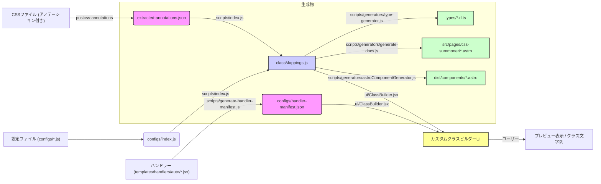

# プロジェクト概要: CSS Summoner

## 1. 目的

- CSSファイル内のアノテーションからコンポーネント情報を抽出し、TypeScriptの型定義、Astroのドキュメントページ、およびAstroコンポーネントを自動生成するツールです。
- カスタムクラスビルダーUIを提供し、コンポーネントの視覚的な構築とプレビューを可能にします。

## 2. 主な機能

- **CSSアノテーション抽出:** `postcss-annotations` プラグインを利用し、CSSファイルから情報を抽出して `extracted-annotations.json` を生成します。
- **TypeScript型定義生成:** 抽出情報と設定に基づき、`src/css-summoner/types/` に型定義ファイル (`*.d.ts`) を生成します。
- **Astroドキュメント生成:** `src/pages/css-summoner/` にコンポーネントのドキュメントページ (`*.astro`) を生成します。
- **Astroコンポーネント生成:** (非推奨の可能性あり) `src/css-summoner/dist/components/` にAstroコンポーネント (`*.astro`) を生成します。
- **マッピングファイル生成:** 設定ファイル (`configs/`) と抽出データ (`extracted-annotations.json`) を統合した `classMappings.js` を生成します。
- **ハンドラー自動検出:** プレビュー用ハンドラー (`templates/handlers/auto/*.jsx`) を自動検出し、`configs/handler-manifest.json` を生成・更新します。
- **カスタムクラスビルダーUI:** (`ui/ClassBuilder.jsx` および `ui/` ディレクトリ)
  - コンポーネントの視覚的なプレビューと構築。
  - モノクロベースのスタイル設計とカラーセレクタによる柔軟なカラー適用。
  - カスタムカラーピッカーによるカラーカスタマイズ。
  - 選択されたカスタムCSSクラスに対応するCSSルールの表示。

## 3. 技術スタック

- **フロントエンド:** Astro, React, TypeScript
- **スタイリング:** Tailwind CSS (`tailwind.config.mjs`)
- **CSS処理:** PostCSS (`postcss-annotations` プラグイン)
- **開発環境:** Node.js (スクリプト実行)

## 4. データフロー

## 5. ディレクトリ構造の概要 (`src/css-summoner/`)

- `ui/`: UI関連 (ClassBuilder.jsx, components, hooks, layouts, templates)
- `configs/`: 設定ファイル群
- `docs/`: ドキュメント
- `scripts/`: ビルド・自動化スクリプト (generators含む)
- `styles/`: CSSスタイルファイル
- `types/`: 生成されたTypeScript型定義
- `utils/`: ユーティリティ関数
- `classMappings.js` (生成物)
- `extracted-annotations.json` (生成物)
- `handler-manifest.json` (生成物)

## 6. 主な使い方 (スクリプト)

- `npm run dev`: 開発サーバー起動 (UIアクセス用)
- `npm run build`: 本番ビルド (ハンドラー生成 + Astroビルド)
- `npm run css`: 型定義、ドキュメントなどを生成
- `npm run css-docs`: ドキュメントのみ生成
- `npm run css-components`: Astroコンポーネントのみ生成
- `npm run css-all`: すべて生成
- `npm run generate:handlers`: ハンドラーマニフェスト生成
- `npm run map`: ファイルマップ (`file-map.md`) 更新
