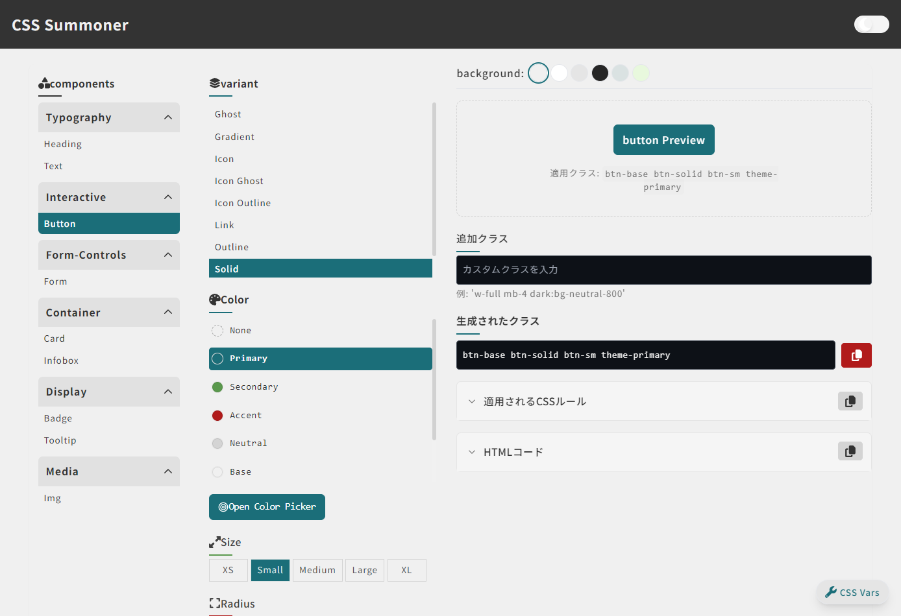

# CSS Summoner



## 🌟 概要

CSS Summonerは、プロジェクトで定義されたカスタムCSSクラスを視覚的にプレビューしながら組み合わせることができるインタラクティブなツールです。クラスの組み合わせを簡単に確認し、生成したコードをコピーして実装に活用できます。

さらに裏側では、型定義ファイルやドキュメント、Astroコンポーネントを自動生成してくれるので、開発効率が大幅に向上します。

⚠️ **注意**: このプロジェクトは開発途中のベータ版です。基本機能は動作していますが、今後も機能追加や改善を続けていきます。

## ✨ 主な機能

### ブラウザ上での視覚的操作

- コンポーネント、バリアント、色、サイズなどを選択するだけでリアルタイムにプレビュー表示
- 生成されたクラス名、適用されるCSSプロパティ、HTMLコードを確認・コピー
- カスタムカラーピッカーによる自由な色のカスタマイズ
- コントラスト比を確認しながらアクセシビリティに配慮した色設定

### 自動生成機能

- CSSファイル内のアノテーション(コメント)からコンポーネント情報を抽出
- TypeScript型定義ファイルの自動生成
- Astroドキュメントページの生成
- Astroコンポーネントの自動生成

## 🎯 このツールが解決する課題

- **デザイン一貫性の維持**: 定義済みのクラスと組み合わせでデザインシステムを統一
- **開発時間の短縮**: 必要なクラスの検索・組み合わせがビジュアルで確認できる
- **コードの品質向上**: 適切なクラスを選ぶことでコード品質が向上
- **ドキュメント作成の自動化（裏で）**: コンポーネントの使い方が自動ドキュメント化
- **型定義の自動生成（裏で）**: TypeScriptでの開発をスムーズに

## 🚀 使い方

### デモを試す

公開デモは [https://css-summoner.netlify.app](https://css-summoner.netlify.app) で利用できます。

### 基本操作

1. **コンポーネントの選択**: 左側メニューからコンポーネントタイプを選択（ボタン、カード、バッジなど）
2. **バリアントの選択**: コンポーネントの種類（Solid、Outline、Ghostなど）を選択
3. **テーマカラーの選択**: プライマリ、セカンダリなどのテーマ色を適用
4. **カスタマイズ**: サイズ、角丸、影、アニメーションなどを選択
5. **プレビュー確認**: 右側でリアルタイムにプレビューを確認
6. **コードの取得**: 生成されたクラス文字列やHTMLコードをコピーして使用

CSS Varsボタン（モバイルでは🎨アイコン）をクリックすると、背景色やCSS変数をさらにカスタマイズできます。

### スタンドアロンツールとして使用

※**現在非推奨です**。Astro、tailwindを利用しているならいけるかも。設定慣れしているなら自己責任でやってみてもいいかも。

```bash
# リポジトリをクローン
git clone https://github.com/llama2f/css-summoner.git

# ディレクトリに移動
cd css-summoner

# 依存関係をインストール
npm install

# 開発サーバーを起動
npm run dev

```

### package.jsonへのスクリプト追加

```json
{
	"scripts": {
		"dev": "npm run setup && astro dev",
		"build": "npm run setup && astro build",
		"map": "node src/css-summoner/scripts/simple-file-mapper.js",
		"css": "node src/css-summoner-integration.js --all",
		"setup": "node scripts/setup.js"
	}
}
```

## 🔧 カスタマイズ

### コンポーネントの追加・拡張

1. **UIオプションの設定**

   - `src/css-summoner/configs/` ディレクトリ内の設定ファイルを編集
   - サイズ (`sizes.mjs`)、修飾子 (`modifiers.mjs`)、色 (`colors.js`) など

2. **Astroコンポーネントの生成カスタマイズ**

   - ハンドラーファイル (`src/css-summoner/ui/templates/handlers/auto/*.jsx`) で `generateAstroTemplate` 関数をエクスポート
   - 詳細は `src/css-summoner/docs/handler-guide.md` を参照

3. **新規コンポーネントの追加**
   - CSSファイルにアノテーションを追加
   - 新しいハンドラーファイルを作成
   - 詳細は `docs/` ディレクトリ内のドキュメントを参照

## 🧩 技術スタック

- **フロントエンド:** Astro, React, TypeScript
- **スタイリング:** Tailwind CSS
- **CSS処理:** PostCSS (`postcss-annotations` プラグイン未満)
- **開発環境:** Node.js

## 📄 ライセンス

MITライセンスの下で公開されています。詳細は[LICENSE](LICENSE)ファイルをご覧ください。

## 👨‍💻 開発者

CSS Summonerは個人の時間を使って開発しているプロジェクトです。質問や提案があれば、GitHubのIssueでお気軽にお問い合わせください。※すべてのご提案への回答が難しい場合があります

このプロジェクトはAI（人工知能）との協働で設計・開発されています。生成されたコード内容は把握するよう努めていますが、問題点などありましたらご連絡ください。

## ❤️ サポート

このプロジェクトが気に入っていただけたら、以下の方法で応援していただけると励みになります：

- GitHubリポジトリに⭐️スターを付ける
- プロジェクトの共有
- フィードバックの提供
- Github Sponsorsによる支援
- [ほしいものリスト](https://www.amazon.jp/hz/wishlist/ls/3FM7AUUJFZ893?ref_=wl_share)の支援
