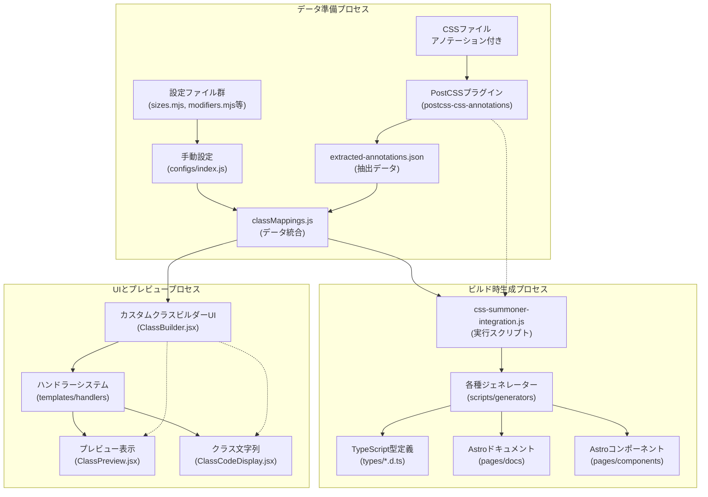

**システム概要:**

1.  **データ準備:**
    *   CSS ファイルに記述されたアノテーション (`@component`, `@variant` など) を `postcss-css-annotations` プラグインが解析し、`extracted-annotations.json` に抽出データを出力します。
    *   サイズ、モディファイアなどの手動設定は `src/css-summoner/configs/` ディレクトリ内のファイルで管理されます。
    *   `classMappings.js` が、`extracted-annotations.json` と `configs/*` からのデータを統合し、アプリケーション全体で利用可能なデータを提供します。
2.  **ビルド時生成:**
    *   `css-summoner-integration.js` スクリプトが実行されます。
    *   このスクリプトは `classMappings.js` から統合データを取得します。
    *   取得したデータに基づき、各種ジェネレーターが TypeScript の型定義、Astro のドキュメントページ、および Astro コンポーネントを自動生成します。
3.  **UI とプレビュー:**
    *   `Classsummoner.jsx` (カスタムクラスビルダー UI) は `classMappings.js` からデータを取得し、コンポーネント選択、バリアント選択などの UI を構築します。
    *   ユーザーが UI でオプションを選択すると、対応するハンドラー (`templates/handlers`) が呼び出されます。
    *   ハンドラーは選択されたオプションに基づいてプレビュー用の HTML を生成し (`ClassPreview.jsx`)、最終的な CSS クラス文字列を生成します (`ClassCodeDisplay.jsx`)。