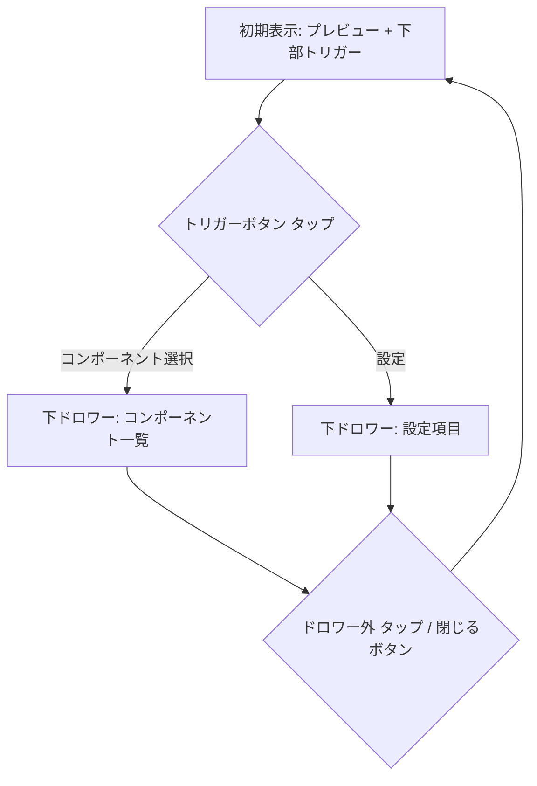

# ClassBuilder スマホビュー パネル UI 設計方針

**更新日:** 2025-04-09

**担当:** Architect Mode

## 1. 背景

`ClassBuilder` コンポーネント (`src/css-summoner/ui/ClassBuilder.jsx`) のスマホビューにおいて、パネル要素 (`panel-components`, `panel-settings`) の表示方法を改善し、ユーザビリティを向上させる。

現状のモバイルレイアウト (`src/css-summoner/styles/builder.css` の `lg:` 未満) では、パネルが縦に並び、プレビューエリア (`panel-preview`) が下に追いやられる問題がある。

## 2. 検討した設計案

以下の案を比較検討した。

| 案                                     | プレビュー視認性 | 操作の容易さ | UI一貫性 | 実装複雑度 | 総合評価 |
| :------------------------------------- | :--------------: | :----------: | :------: | :--------: | :------: |
| ユーザー提案 (横スライド + 下ドロワー) |        △         |      △       |    △     |     中     |    △     |
| **推奨案 (全て下ドロワー)**            |      **◎**       |    **◎**     |  **◎**   |     中     |  **◎**   |
| アコーディオン形式                     |        △         |      〇      |    〇    |     低     |    △     |
| タブ切り替え形式                       |        〇        |      〇      |    〇    |   低～中   |    〇    |

## 3. 推奨設計方針: 全て下ドロワー形式

**理由:**

- **ユーザビリティ最優先:** スマートフォンでの片手操作に適した画面下部のドロワー形式を採用し、UIインタラクションを統一することで、最もシンプルで直感的な操作感を提供。
- **プレビューの重視:** プレビューエリアの視認性を常に最大限確保。設定パネルは必要な時にのみ表示。
- **実装:** 一般的なUIパターンであり、実装・管理が比較的容易。

**具体的な実装イメージ:**

1.  画面下部に固定でトリガーボタン（例：「コンポーネント選択」「設定」）を配置する。
2.  各ボタンをタップすると、対応するパネルの内容 (`panel-components` または `panel-settings`) が画面下からドロワーとしてスライドインする。
3.  ドロワー表示中は、背景のプレビューエリアは操作不可とする（またはドロワー外タップで閉じる）。
4.  ドロワーを閉じると、トリガーボタンのみが表示された状態に戻る。

**Mermaid ダイアグラム (UIフロー):**

## 4. 検討事項

- ドロワー内のコンテンツ量が多い場合、ドロワー内部でのセクション分け（例: アコーディオン、タブ）やスクロールの必要性を検討する。
- ドロワーの開閉アニメーションをスムーズにし、操作感を向上させる。
- トリガーボタンのデザインと配置を、他のUI要素との整合性を考慮して決定する。

## 5. 次のステップ

この設計方針に基づき、`code` モードで具体的な実装を行う。
